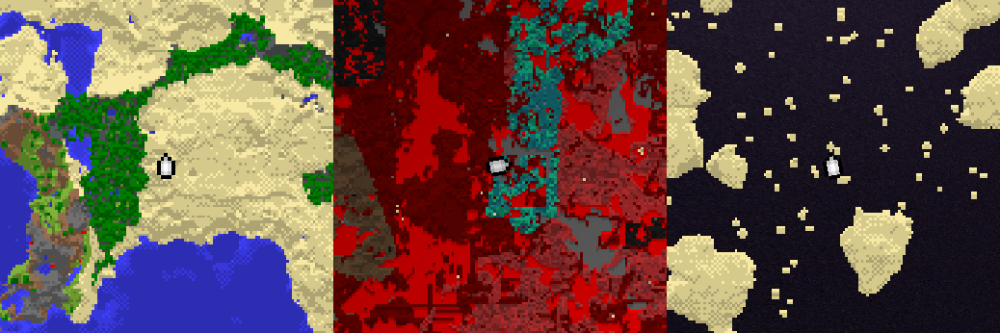
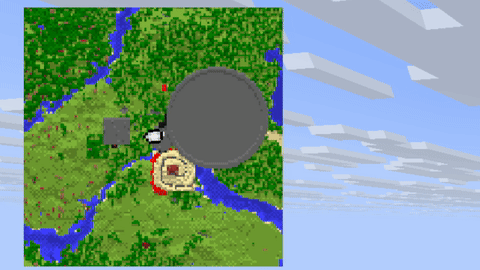
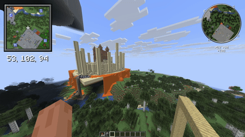

<div align="center">

# NMinimap

Serverside minimap based on core shaders



</div>

### Features

- Round and square minimap
- Unlimited amount of custom markers
- Side of the screen selection (left or right)
- Scale of map from 1x (1 pixel = 1 block) to 8x (1 pixel = 8x8 blocks)
- Async work as much as possible
- Map size 127 x 127 pixels
- Automatic resource pack build

### Supported server platforms
- [Papermc](https://papermc.io/software/paper/)
- [Folia](https://papermc.io/software/folia/)
- Spigot is not supported due to it do not have all necessary api features

### Showcase





### Dependencies

- [AnvilORM](https://github.com/NezuShin/AnvilORM/releases/)
- [Packet events](https://www.spigotmc.org/resources/packetevents-api.80279/)
- [PassengerAPI](https://www.spigotmc.org/resources/passengerapi-entity-passenger-bug-fixes-more.117017/) (Optional; Needed for compatibility with another plugins)
- [PlaceholderAPI](https://www.spigotmc.org/resources/placeholderapi.6245/) (Optional; If you need placeholders)

### Installation

- Install all [dependencies](#dependencies)
- Download jar from releases and put it to the server's plugins directory.
- Restart the server

Also, you can configure [PackMerger](https://www.spigotmc.org/resources/packmerger.132700/)
or [Resource Pack Manager](https://www.spigotmc.org/resources/resource-pack-manager.118574/) for resource pack merge and distribution

### Permissions

- `nminimap.admin` - access for `/minimap admin` command
- `nminimap.scale.1/2/4/8` - access for `/minimap scale` command (if enabled in config)
- Another minimap commands can be accessed without any premissions

### Admin commands
- `/minimap admin reload` - reload config
- `/minimap admin stats` - get statistics info 

### User commands

- `/minimap scale 1/2/4/8` - set map scale. 1 - one block per pixel, 2 - four blocks per pixel (2x2 zone), etc
- `/minimap side left/right` - set side of the screen where map will be displayed
- `/minimap style round/square` - set map round or square
- `/minmap disable/enable` - disable or enable map

### PlaceholderAPI Placeholders

#### Player related:
- `nminimap_enabled` - true or false
- `nminimap_scale` - 1, 2, 4, 8
- `nminimap_side` - right or left
- `nminimap_style` - round or square

#### Statistics related:
- `nminimap_stats_loaded_tiles` - count of tiles in ram, number
- `nminimap_stats_cache_size` - total count of all cached chunks, number
- `nminimap_stats_enabled_maps` - how many players use map right now, number
- `nminimap_stats_threads` - how many plugin's threads running right now, number

### Markers

Markers are just font images with special marks on texture, so they have same limitations:
- No animations. But you can replace the icon to another one every AsyncMarkerRenderEvent call using API.
- Texture size is limited to 256 x 254 pixels (two extra columns used for marks)
- Note that large amount of big images can significantly slow down resource pack loading. 


To add marker, drop your image to `markers` directory and type `/minimap admin reload`. New resourcepack will be generated. \
You can make images smaller by increasing image size with same texture. Like in `player_small` default marker.

### Compatibility 

#### Core shaders and another plugins
Plugin uses `rendertype_text` shader, so shaders for hud or text decorations may not be compatible. In most plugins you must 
disable text decorations for NMinimap work. \
Patched shader for BetterHUD is already [provided](betterhud-patching.md). If you are developer you can add compatibility with your plugin using this example easily

#### Mods

Plugin can turn off some mod-driven minimaps at all or while serverside minimap enabled:




Supported mods:
- [Xaero's Minimap](https://modrinth.com/mod/xaeros-minimap)
- [VoxelMap-Updated](https://modrinth.com/mod/voxelmap-updated)
- [JourneyMap](https://modrinth.com/mod/journeymap)
- Another mods do not have such functionality, or it is not documented. 


### How does it work?

#### Maps
Plugin spawns packet-based invisible item frames with a map in it and renders the map with special sequence on first row. 
Shader detects this row and places the map at corner of the screen. Vanilla maps still works (Except one map id used for display. Id is configurable).  
The first map column is also disabled for symmetry.

#### Markers

Marker images have for pixels with specific color on then's corners. For every combination of map style and screen corner image is being created. Four images in total \
Also color of image is used. Red is X position on map. Green is Y position on map. Blue is marker rotation.

### API

Change player's map settings
```java
public void changeSettings(Player p) {
    var player = NMinimap.getInstance().getPlayersWithMap().stream().filter(i -> i.getPlayer().equals(p)).findFirst().orElse(null);

    player.setEnabled(true);
    player.setScale(8);
    player.getRight(true);
    player.setRound(true);
}
```

Draw on map and add markers. Both events being called on every map redraw. 

```java
@EventHandler
public void drawDot(AsyncMapRenderEvent event){
    byte[] mapData = event.getMapData();

    //middle of the map
    int x = 64;
    int y = 64;

    //Accepts only colors from ColorUtil.colors. Another values will result transparent color
    mapData[x + (y * 128)] = ColorUtil.exactColor(ColorUtil.colors[10]);


    int anotherX = 1;//first row is reserved for internal use. First **column** is disalbed for symmetry.  Displayed map has resolution 127 x 127
    int anotherY = 1;

    //Similar to deprecated MapPalette.matchColor(). Will find most nearest color.
    mapData[anotherX + (anotherY * 128)] = ColorUtil.getNearestColor(Color.fromRGB(255, 0, 0));
}

@EventHandler
public void drawMarker(AsyncMarkerRenderEvent e){
    List<NMapMarker> markers = e.getMarkers();

    String markerIcon = "player";//Icon from NMinimap/markers directory

    //Add marker with fixed location
    markers.add(new LocationMarker(markerIcon, new Location(e.getPlayer().getPlayer().getWorld(), 1, 1, 1)));

    int positionMarkerX = 0;//Accepts values from -127 to 127. -127 - left. 127 - right
    int positionMarkerY = 0;//-127 - top. 127 - bottom
    int positionMarkerRotation = 0;//from 0 to 256. 0 points top, 128 points bottom

    //Add marker with relative position on map.
    markers.add(new PositionMarker(markerIcon, positionMarkerX, positionMarkerY, positionMarkerRotation));

}
```


### Inspirations
- [VanillaMinimaps](https://github.com/JNNGL/VanillaMinimaps)
- [Cartographer2](https://www.spigotmc.org/resources/cartographer-2-1-8-9-1-21-the-best-minimap-plugin-for-bukkit.46922/)
- [Minimap control](https://modrinth.com/plugin/minimap-control)


### Credits
- [NezuShin](https://github.com/NezuShin) - Plugin development
- [DartCat25](https://github.com/DartCat25) - Shader development
- [DEMEMZEA](https://github.com/DEMEMZEA) - Help with readme


### Help and support

If you have questions, want ask for a feature or report a bug - feel free to [open issue](https://github.com/NezuShin/NMinimap/issues),\
Also you can ask a question in the [discord server](https://discord.gg/rZ7gfCTr3Y).
